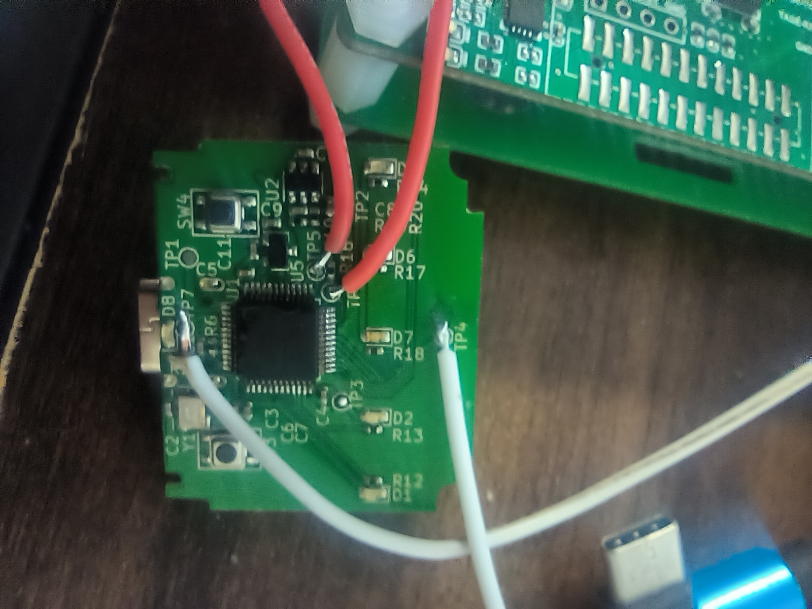

# 说明
## 安装方法
- ps5手柄(BDS010 020 030都行)
- 使用四背键版本charmfocus背键套件
  - https://item.taobao.com/item.htm?id=724655518718
  - 套餐5
- 背键套件上面4个黑色螺丝拧掉,把电路板模块拆下来
- 电路板模块上4个黑色螺丝拧掉,露出电路板
- 如图飞线引出编程口
- 
- TP4：地线 ；TP5，TP6：SWCLK SWDIO； TP7:复位线
- 不明单片机(上述电路板上个头最大的芯片)替换为STM32F103C8T6
  - 注意1脚方向
- 电路板反面USB DP脚接1.5k电阻上拉到usb电源(+5V)
- 用编程器烧写固件
- 装回所有东西,然后按官方视频将背键套件安装到手柄上
- ps5上打开原神,切出散兵按1号背键即自动执行15重击操作
## TODO
- 实现USB下载固件(Bootloader)接口以避免再背键套件上钻孔引出编程线
- MCU型号替换为封装兼容的自带USB DP上拉的型号以避免飞1.5k电阻
- 实现usb控制背键模块接口
- 实现电脑下载鼠标宏脚本到背键模块的接口
- 搞清楚手柄L2 R2为什么控制不了
- 实现更多鼠标宏
  - 优菈稳定13层
  - 滑步弓